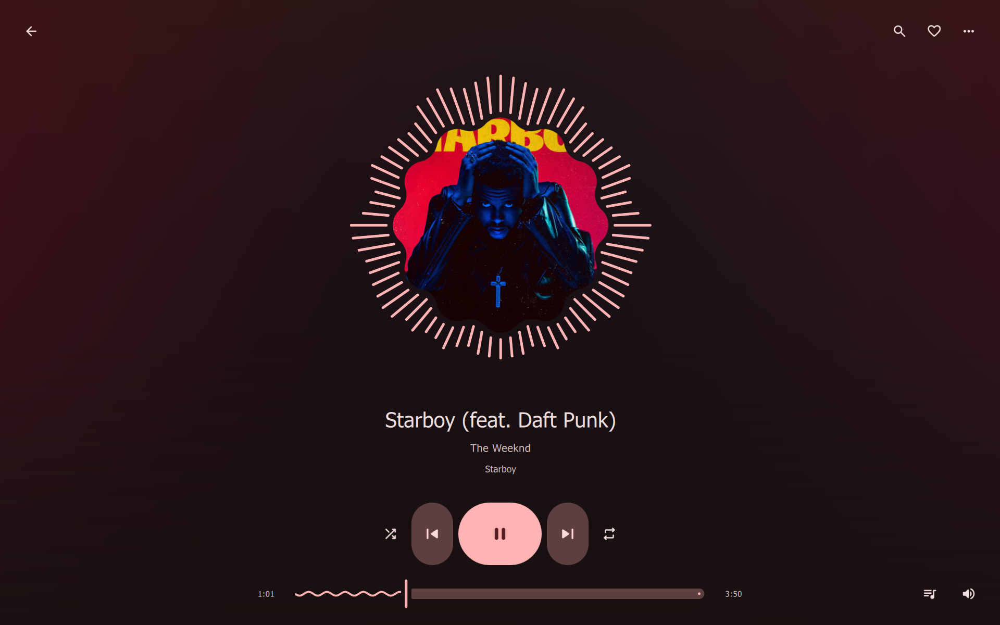

<div align="center">



# Sung for Windows

**YouTube Music, your music files, and your music server. Native, portable, no browser.**

[](LICENSE)


[Download](#install-on-windows) · [What this build adds](#what-this-build-adds) · [Features](#features) · [Build from source](#build-from-source) · [Troubleshooting](#troubleshooting)

</div>

> Sung is a beautiful, minimal Material 3 player written in C++ and Qt Quick by [**@yappologistic**](https://github.com/yappologistic) — all credit for the player is theirs: [github.com/yappologistic/Sung](https://github.com/yappologistic/Sung). This repository packages it for Windows.

## What this build adds

- **Downloads** — YouTube songs can be saved as real audio files. Choose a folder under **Settings → Library → Downloads** (a Sung folder inside your Music by default), then **Download** any song from its menu — the track menu, the bulk selection menu or the track-details dialog. Each song lands as an `.m4a` with its own tags and cover stamped on, fetched by the same helper that streams and finished with the bundled ffmpeg. One download runs at a time; a pill above the playback bar shows progress and cancels, and a tray balloon carries the news while the window is hidden.
- **Save songs you play** — with the switch under **Settings → Library**, any song heard long enough to count as listened — the same point it enters your history — queues for the downloads folder on its own, bringing the same files, tags and covers the Download action brings. A ledger keeps every heard song to one fetch; one that failed is not in it, so the next hearing asks again. Skipped songs are not saved, and a paused listening history (private sessions) pauses auto-saving with it.
- **Performance mode** — one switch under **Settings → Appearance** for integrated GPUs and low-end machines: flat surfaces, no washes in the panes, no Motion layout, no visualizer and no animated covers, while playback, lyrics and browsing are unchanged. Frame pacing, worker-thread decodes and a periodic working-set trim sit underneath either way, so the interface stays smooth.
- **System tray** — optionally keep Sung in the notification area: **minimize to tray** tucks the window away while the music plays, and **close to tray** leaves it running when the window is closed, so quitting is a choice made from the tray icon's menu (Open, Play/Pause, Previous, Next, Quit). Both live under **Settings → Connections → System tray**.
- **Window memory** — the window comes back the size, position and maximized state it was left in; a first run opens centred on the screen.
- **SponsorBlock** — sponsor reads, self-promotion, long intros and other non-music segments are skipped automatically, using community timings from [sponsor.ajay.app](https://sponsor.ajay.app). Off by default; turn it on under **Settings → Playback → Skip non-music segments**. While the switch is off, nothing is sent anywhere.
- **Discord Rich Presence** — the playing track appears on your Discord profile with its cover, elapsed time and a button back to the song, through Discord's own local pipe connection. No token, no extra account, no third-party service. Off by default; enable under **Settings → Connections → Discord**.
- **Proxy support** — every outbound request (YouTube Music, yt-dlp, lyrics, artwork, SponsorBlock) can go through an HTTP or SOCKS5 proxy under **Settings → Connections → Network**, for example `http://127.0.0.1:8080` or `socks5://host:1080`.
- **Interface refinements** — the mini player reads as one rounded card with no square slab behind it; the fullscreen lyrics column can sit left, centre or right (the immersive layout menu, or **Position in full screen** in the Lyrics dialog); and the visualizer can carry a small lyrics line under the ring (**Lyrics in visualizer** in the same menu).

## Install on Windows

1. Download `Sung-windows-x64.zip` from the [**Releases**](https://github.com/mewshiam/Sung-windows/releases) page.
2. Unzip it anywhere — `C:\Tools\Sung`, a user folder or a USB drive all work. No installer, no admin rights.
3. Run `Sung\bin\sung.exe`.

The zip is self-contained: Qt, an embedded Python runtime for the YouTube helper, and ffmpeg all ship inside it.

```
Sung\
├── bin\        sung.exe, Qt DLLs and plugins, MSVC runtime, ffmpeg/ffprobe, qt.conf
├── helper\     the Python sources (also embedded in the exe as resources)
├── runtime\    embedded Python with ytmusicapi + yt-dlp preinstalled
├── licenses\   third-party license texts
├── LICENSE · NOTICE · README.md
```

- **SmartScreen** may warn on first launch ("Windows protected your PC"). The exe is unsigned; choose *More info → Run anyway*.
- Settings and library data live under `%APPDATA%\Sung`, like any well-behaved Windows program.
- Keep the zip's folder structure: `runtime\` must stay next to `bin\`, or the YouTube helper cannot start.

### Notes and limitations on Windows

- **Media keys and the system media flyout** are not wired up yet — playback control lives in the app itself, the tray icon included. WinRT's `SystemMediaTransportControls` is the natural next step.
- **Now-playing notifications** appear as tray balloon toasts on the tray icon, whenever that exists: a toast, or one of the tray options, puts it there.
- **"Remember me" for server logins** degrades to a per-session sign-in with a clear message from the app.
- **Pause on headphone disconnect**: a vanished audio device pauses playback through Qt's own device notifications.
- The **single-instance guard** uses a named pipe derived from your profile path, so two Windows users each get their own instance, and double-clicking the exe again raises the existing window.
- Song titles and searches in **any language** work: the helper speaks UTF-8 end to end.

## Features

- **YouTube Music**: search songs, albums, artists and playlists; play audio without an embedded browser or ad interface, at standard quality or a data saver setting.
- **Navidrome / Subsonic**: browse and search your server, play original or transcoded audio, edit server playlists, rate songs, sync favorites and listening history, and display server lyrics.
- **Jellyfin**: browse music libraries, albums, artists and genres; search, stream original or transcoded audio, manage permitted server playlists, sync favorites and display synchronized lyrics.
- **Your music**: import FLAC, MP3 and other supported audio files or folders; browse albums and artists, search paths and group songs by folder. Mix local and YouTube songs in the same playlists.
- **Animated artwork**: local animated covers and automatic online covers for matching YouTube songs, shared across the player, immersive view and mini player; lists use still covers.
- **Appearance**: light and dark themes, a pickable Material accent color, artwork-derived color, an ambient cover backdrop, density and per-view layouts.
- **Lyrics**: synchronized lyrics, an immersive view, optional poster-style lines, timing adjustments, LRC import, seek previews and search with jump-to-line playback.
- **Offline**: songs you have played are kept on disk under a limit you set, so a replay starts at once and needs no network; any song can also be saved for real to your downloads folder, by hand or automatically as you listen.
- **Library tools**: likes, listening history, smart mixes, custom smart playlists, M3U playlist import and export, custom playlist covers, playlist cleanup, multi-selection, drag reordering and Undo.
- **Playback controls**: mini player, queue editing with source headings, an immersive up-next carousel, volume normalization, shuffle, repeat, sleep timer, playback speed and audio-device selection.
- **Keyboard and assistive use**: every control takes focus and shows it, sections are marked as headings, and colors are solved to keep 4.5:1 contrast in both themes and at either contrast setting.
- **System tray**, **Downloads**, **SponsorBlock**, **Discord Rich Presence**, **Performance mode** and **Proxy** as described above — the optional ones switched off until you turn them on in Settings.

Native rendering and bounded artwork caches keep Sung lightweight. Animations can be disabled in Settings.

## Using Sung

On first run Sung offers a three-step setup: theme and accent color, a music folder, and the page to open on. Every step can be skipped, and each control also lives in Settings.

**YouTube.** Search from the capsule at the top of the window, or paste a song, album or playlist link. Playback controls, the queue (**Ctrl+L**) and the immersive player (**F11**) are one click away. Streaming quality and offline keeping are under **Settings → Privacy & data**. The next queued song is prepared while the current one plays — starting the moment the song begins rather than in its final minute, and under shuffle too, where the next song is drawn in advance — so skipping and song changes start at once.

**Local files.** Use **Library → Local files → +** to import files, or **Folders → Add folder…** for a whole music folder (subfolders are scanned recursively and updates are watched while Sung runs). Local and YouTube songs mix freely in the same playlists.

**Downloads.** Saved songs go to the folder chosen under **Settings → Library → Downloads** — a Sung folder inside your Music until you pick another, and **Open downloads folder** jumps straight to it. **Download** sits on every YouTube song's menu: single songs, the bulk selection and the track-details dialog; local and server songs are already files you hold, so only YouTube rows offer it. A pill above the playback bar carries progress and a cancel button, and each finished song announces itself — a toast in the window, a tray balloon when it is hidden. With **Save songs you play** on, anything heard long enough to count as listened lands in the folder on its own: fetched once per song, asked again on the next hearing if the fetch failed, never for songs skipped early and never while listening history is paused.

**Music servers.** Open **Settings → Connections → Music server**, choose **Subsonic** (including Navidrome) or **Jellyfin**, and enter the server root address, username and password. One server account can be connected at a time; a "remember me" checkbox is offered where the platform can store credentials. Local playlists can mix YouTube, local and server songs; server playlists accept songs from that server only.

**Playlists and tools.** Create smart playlists from artist, title, year, length, source and liked-status rules; import and export M3U; drag to reorder; use **Clean up** to review duplicates and missing files. Up to 20 listening sessions save your queue and playback settings for later.

**Lyrics.** Synchronized lyrics load for YouTube and server songs; import your own `.lrc`, adjust timing, or open the immersive view with poster-style lines.

**Privacy.** YouTube browsing is anonymous; likes, playlists and history stay on your machine and never sync with a Google account. There is no analytics or telemetry. Optional lyric lookups send only the song's title, artist and duration and can be disabled. Library data can be exported and re-imported as JSON. Everything lives under `%APPDATA%\Sung`.

### Keyboard shortcuts

| Shortcut | Action |
| --- | --- |
| Space | Play / pause |
| Ctrl+F | Focus search |
| Ctrl+Shift+P | Quick actions |
| Ctrl+J | Show the playing song in the queue |
| ? / F1 | Keyboard shortcut reference (outside text fields) |
| Ctrl+M | Toggle mini player |
| F11 | Toggle immersive player |
| 0 – 9 | Jump to that tenth of the track |
| Ctrl+A | Select songs in the focused list |
| Escape | Close the current view or clear selection |

The full, day-to-day manual — artwork pipelines, volume normalization details, server integration fine print and more — lives in the [upstream README](https://github.com/yappologistic/Sung#readme).

## Build from source

Requirements: **Qt 6.10 or newer** (MSVC 2022 64-bit kit with Core, Concurrent, Gui, Quick, Qml, QuickControls2, Multimedia, Network and Svg — the online installer's default "Qt 6.10 for desktop development" covers all of them; the QML bytecode step uses `DISCARD_QML_CONTENTS`, which older Qt releases lack), **Visual Studio 2022** with the C++ toolset (or just the Build Tools), and **CMake 3.24+** with **Ninja**. Python is not needed to build; pip/PyPI access is needed once to prepare the bundled helper runtime.

From an *x64 Native Tools Command Prompt for VS 2022*:

```bat
cmake -S . -B build -G Ninja -DCMAKE_BUILD_TYPE=Release -DBUILD_TESTING=OFF
cmake --build build

mkdir Sung\bin
copy build\sung.exe Sung\bin\
C:\Qt\6.10.3\msvc2022_64\bin\windeployqt.exe --release --no-translations ^
    --no-system-d3d-compiler --no-opengl-sw Sung\bin\sung.exe
copy helper\catalog.py helper\online_artwork.py helper\requirements.txt Sung\helper\
```

`build\sung.exe` embeds the QML, icons and the helper's Python scripts as Qt resources; it needs Qt's DLLs beside it, which `windeployqt` provides. To reproduce the fully self-contained zip that CI produces (embedded Python with `ytmusicapi` and `yt-dlp` preinstalled, ffmpeg beside the exe), read [`.github/workflows/windows.yml`](.github/workflows/windows.yml) — it is the authoritative recipe, step by step.

## Troubleshooting

- **"YouTube helper could not start"** — the `runtime\` folder must sit next to `helper\` and `bin\`. If you moved files, keep the zip's structure.
- **Playback problems** — playback depends on YouTube availability, region and network conditions. The next song is buffered while the current one plays, but a first start can still take a moment.
- **YouTube playback breaks after an upstream change** — update the resolvers inside the package with the bundled interpreter:

  ```bat
  Sung\runtime\python.exe -m pip install --upgrade "yt-dlp[default]" ytmusicapi
  ```

  …or simply grab the newest release, which ships current versions.
- **SmartScreen warning** — the portable exe is unsigned; *More info → Run anyway* is expected until a signing certificate is set up.
- **Blank or generic file icon** — Windows caches file icons per path. After replacing the exe, run `ie4uinit.exe -show` from the Run dialog (Win+R), or simply move or rename the `Sung` folder; the icon then appears. The icon is embedded in the exe in the classic multi-size bitmap format, so no special viewer is needed.
- **No sound / codec issues** — Qt Multimedia uses Windows Media Foundation with its own ffmpeg runtime; copying the package folder wholesale avoids missing-DLL problems.

## Credits and license

- **[Sung](https://github.com/yappologistic/Sung)** — [**@yappologistic**](https://github.com/yappologistic), the original author of the player.
- Windows packaging and the small additions described above — the community build in this repository.
- [SponsorBlock](https://sponsor.ajay.app) community segment data; Discord via its local IPC; lyrics from [LRCLIB](https://lrclib.net); artwork matching via Apple Music's public pages and [MusicBrainz](https://musicbrainz.org).

[MIT](LICENSE). Material Symbols are licensed under Apache-2.0; see [NOTICE](NOTICE) for third-party acknowledgments. Sung is an independent project and is not affiliated with Google, YouTube or Discord.
